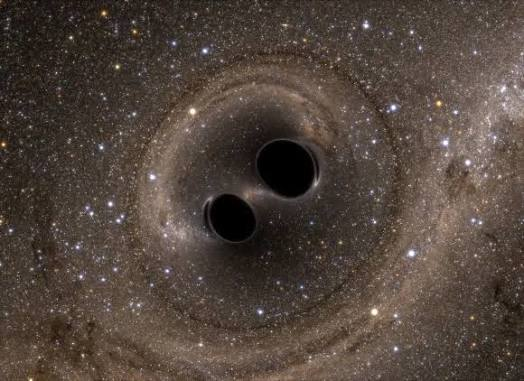
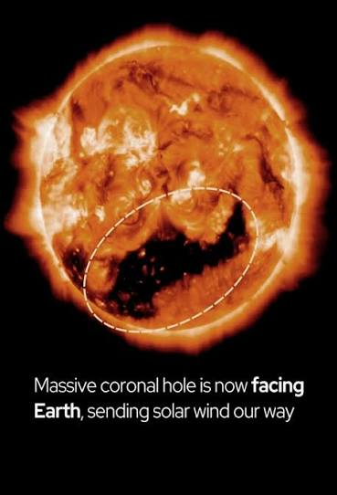

Under my home on Washington street are two singularity that were in a decaying orbit around each other in which I have changed the decay into expansion. This reversed the collapse of 17 million galactic clusters from falling into a hole here in San Francisco. This story is long and complicated to be revealed later nevertheless the have named me Emperor as the Hubble constant holding these galactic clusters from extinction from the collapse 

With first contact with them here and the saves us all

